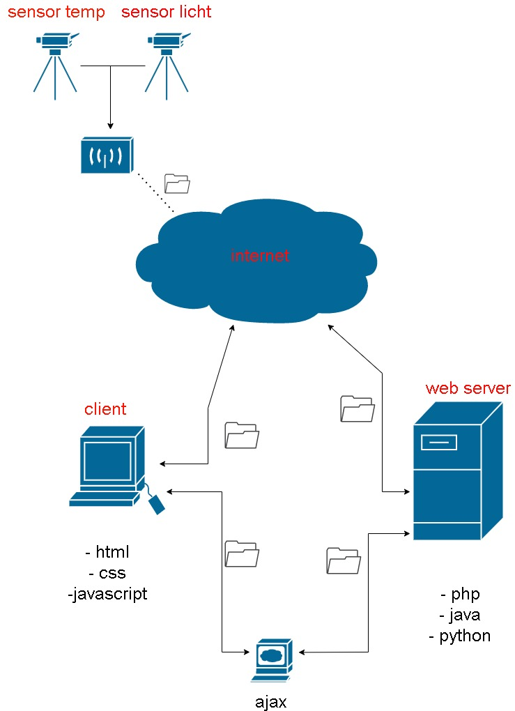

# IoT

links boven:

Links boven in het schema zijn de sensoren die verzamelen data en sturen deze via een ESP8266 door. Via een http transfer wordt deze data verstuurt deze wordt dan vervolgens via een collectior.php pagina gesampled en in mijn database gezet.

links onder:

Hier is de client. Hier speelt zich dan ook de client side af, dit is wat de gebruiker te zien krijgt met andere woorden de front end van de website. Hier bevindt zich dan ook het form.php dit is voor handmatig data te inserten in de database 

midden onder:

Dit is het ajax gedeelte wat hier gedaan wordt is een search creëren. Wat specifiek is aan deze search is dat de pagina niet helemaal gerefreshed moet worden zodra er specifieke data gezocht wordt. Deze gaat via een eigen gemaakte browser de pagina refreshen. 

rechts onder:

Hier is de webserver. Hier wordt alle data opgeslagan en speelt zich ook de meeste code af. De database die gebruikt is is Adminer wat deze database speciaal maakt is dat deze snel kan filteren tussen veel data 

